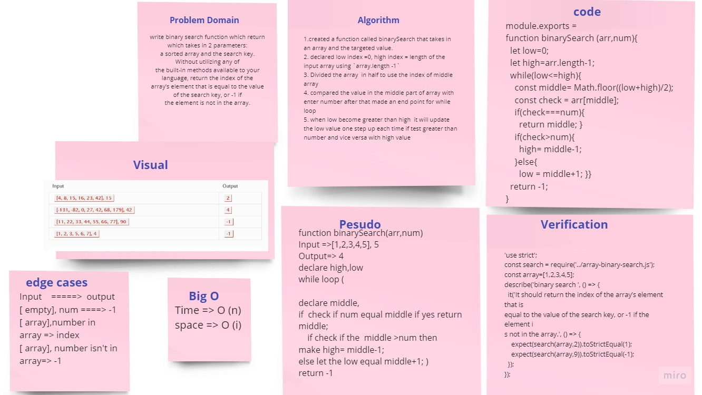

# Binary Search Algorithm
How to write binary search function which return which takes in 2 parameters:
a sorted array and the search key. Without utilizing any of 
the built-in methods available to your language, return the index of the 
array’s element that is equal to the value of the search key, or -1 if
the element is not in the array.

---

### Challenge
I have to write function that will search in the sorted array for the targeted value in a binary way.
---

### Approach & Efficiency
I created a function called binarySearch that takes in an array and the targeted value, then I declared low index =0, high index =length of the input array using `array.length -1`, then divided the array it in half to use the index of middle array then  compared the value in the middle part of array with enter number after that made an end point for while loop when low become greater than high  it will update the low value one step up each time if test greater than number and  vice versa with high value

---
### 401 Code Challenges table

[Go Here ⚡](https://github.com/engnour94/data-structures-and-algorithms/tree/main/javascript/code-challenges/main%20readme)

---
### Solution

