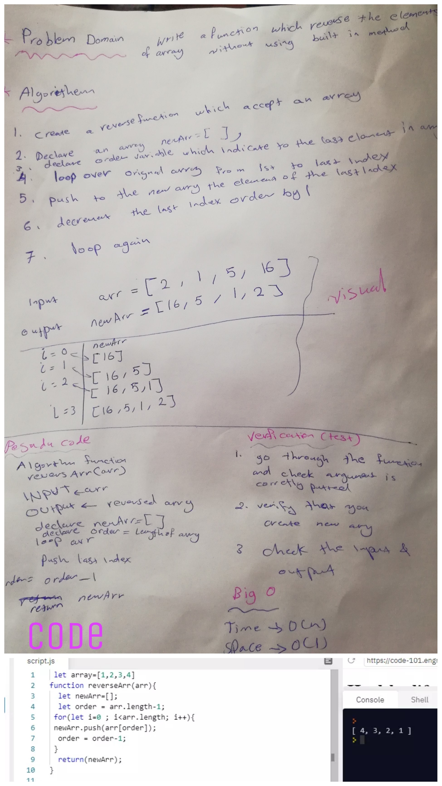

# Reverse an Array
How to reverse an array without utilizing built in method .

### Challenge
write function that will reverse an array without using built-in method.

### Approach & Efficiency
- I created a function called `reverseArray` that take in an array as an argument, in the function I created a new empty array and variable order to specify the index from the end of the array and I did a  for loop to loop over the original array elements and I used push to push the element of index = order to the new array  finally returned the new array.

### Solution
