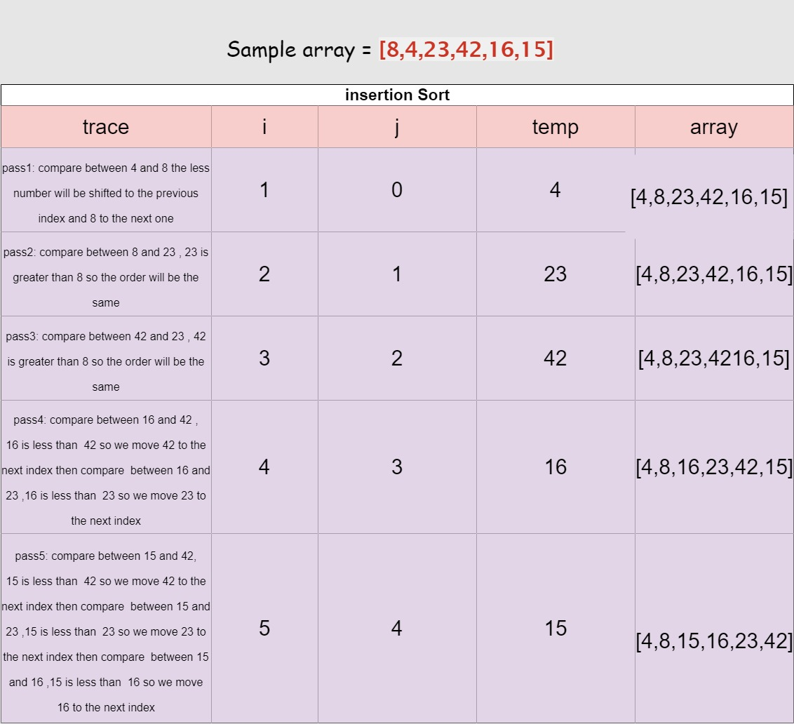

# Insertion Sort

## Pseudocode

 >>InsertionSort(int[] arr)
    FOR i = 1 to arr.length
      int j <-- i - 1
      int temp <-- arr[i]
      WHILE j >= 0 AND temp < arr[j]
        arr[j + 1] <-- arr[j]
        j <-- j - 1  
     arr[j + 1] <-- temp

## trace 

##  - **Big O**
    * space O(1)
    * time  : 
       *  Best case (the array is sorted) O(n)
       * Average case (random array ) O(n^2)
       * Worst  case (sorted oppositely ) O(n^2)
