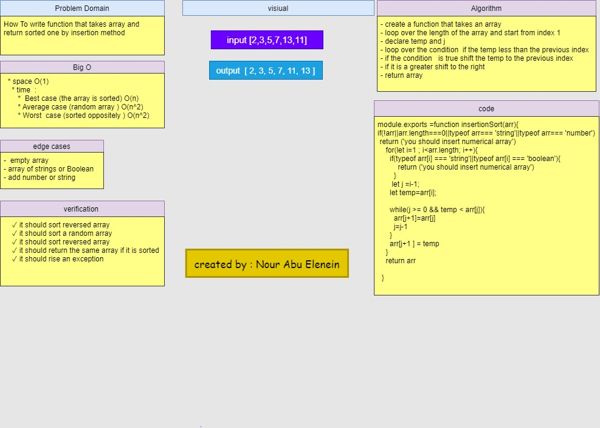

# insertion sort

### Challenge

-To write function that takes array and return sorted one by insertion method

### Approach & Efficiency
- create a function that takes an array
- loop over the length of the array and start from index 1 
- declare temp and j 
- loop over the condition  if the temp less than the previous index 
- if the condition   is true shift the temp to the previous index
- if it is a greater shift to the right 
- return array

 - **Big O**
    * space O(1)
    * time  : 
       *  Best case (the array is sorted) O(n)
       * Average case (random array ) O(n^2)
       * Worst  case (sorted oppositely ) O(n^2)

### Solution

### github workflow actions

[Go Here!](https://github.com/engnour94/data-structures-and-algorithms/actions)

### 401 Challenges

[Go Here!](/javascript/Readme.md)
