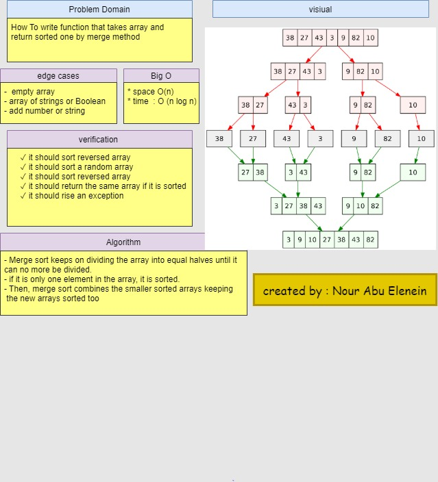

# Merge sort
Merge sort is a sorting technique based on divide and conquer technique. With worst-case time complexity being Ο(n log n), it is one of the most respected algorithms.

Merge sort first divides the array into equal halves and then combines them in a sorted manner.

### Challenge

- To write function that takes array and return sorted one by merge method

### Approach & Efficiency

- Merge sort keeps on dividing the array into equal halves until it can no more be divided.
- if it is only one element in the array, it is sorted.
- Then, merge sort combines the smaller sorted arrays keeping the new arrays sorted too

 - **Big O**
    * space O(n)
    * time  O( n log n )

### Solution

### github workflow actions

[Go Here!](https://github.com/engnour94/data-structures-and-algorithms/actions)

### 401 Challenges

[Go Here!](/javascript/Readme.md)
