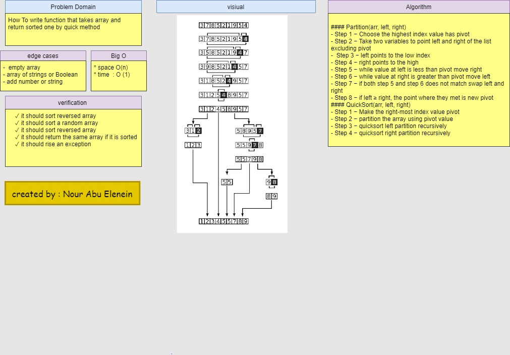

# Quick sort
Quick sort is a highly efficient sorting algorithm and is based on partitioning of array of data into smaller arrays. A large array is partitioned into two arrays one of which holds values smaller than the specified value, say pivot, based on which the partition is made and another array holds values greater than the pivot value.

Quicksort partitions an array and then calls itself recursively twice to sort the two resulting subarrays.

### Challenge

- To write function that takes array and return sorted one by quick sort algorithm

### Approach & Efficiency

#### Partition(arr, left, right) 
- Step 1 − Choose the highest index value has pivot
- Step 2 − Take two variables to point left and right of the list excluding pivot
-  Step 3 − left points to the low index
- Step 4 − right points to the high
- Step 5 − while value at left is less than pivot move right
- Step 6 − while value at right is greater than pivot move left
- Step 7 − if both step 5 and step 6 does not match swap left and right
- Step 8 − if left ≥ right, the point where they met is new pivot

#### QuickSort(arr, left, right)
- Step 1 − Make the right-most index value pivot
- Step 2 − partition the array using pivot value
- Step 3 − quicksort left partition recursively
- Step 4 − quicksort right partition recursively

 - **Big O**
    * space O(1)
    * time  O( n log n )

### visual 

### Solution

### github workflow actions

[Go Here!](https://github.com/engnour94/data-structures-and-algorithms/actions)

### 401 Challenges

[Go Here!](/javascript/Readme.md)
