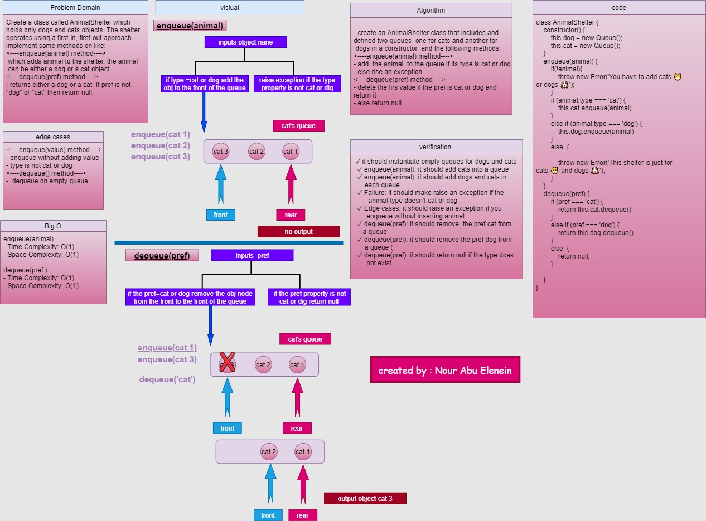

# First-in, First out Animal Shelter

Create a class called AnimalShelter which holds only dogs and cats objects. The shelter operates using a first-in, first-out approach

### Challenge

   - The `AnimalShelter` should have `enqueue` and `dequeue` methods.
 
### Approach & Efficiency

### <----enqueue(animal) method---->
- create an AnimalShelter class that includes and
defined two queues  one for cats and another for dogs in a constructor  
 - add  the animal  to the queue if its type is cat or dog 
- else rise an exception
**Big O**
- Time Complexity: O(1).
- Space Complexity: O(1).

--- 

### <----dequeue(pref) method---->

- delete the firs value if the pref is cat or dog and
return it
- else return null

**Big O**
- Time Complexity: O(1).
- Space Complexity: O(1).
---
### API
The PseudoQueue class code contains two methods:

- `enqueue(animal)` adds animal to the shelter. animal can be either a dog or a cat object.
- `dequeue(pref)`  returns either a dog or a cat. If pref is not "dog" or "cat" then return null.

### Solution
[link](https://drive.google.com/file/d/1vcNEX3I2GwRN0gmenXbUs0NUdFbhZDjp/view?usp=sharing)

### github workflow actions

[Go Here](https://github.com/engnour94/data-structures-and-algorithms/actions)

### 401 Challenges

[Go Here!](/javascript/Readme.md)

