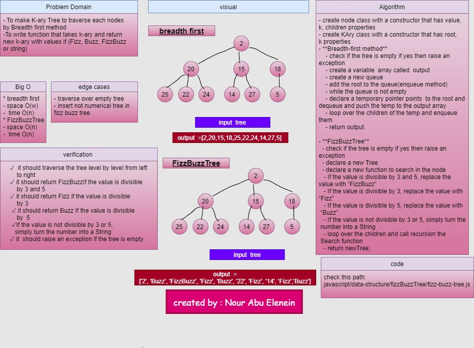

# izzBuzzTree

### Challenge
- To make K-ary Tree to traverse each nodes by Breadth first method 
-To write function that takes k-ary and return new k-ary with values if (Fizz, Buzz, FizzBuzz or string)

### Approach & Efficiency
- create node class with constructor that has value , k , children properties
- create KAry class with constructor that has root , k properties

- **Breadth first method** 
    - check if the tree is empty if yes then raise an exception
    - create a variable  array called  output 
    - create a new queue
    - add the root to the queue(enqueue method)
    - while the queue is not empty  
    - declare a temporary pointer points  to the root and dequeue and push the temp to the output array
    - loop over the children of the temp and enqueue them  

    - return output
 - **Big O**
    * space O(w)/time O(n)

- **FizzBuzzTree**
  - check if the tree is empty if yes then raise an exception
  - declare a new Tree 
  - declare a new function to search in the node
   - If the value is divisible by 3 and 5, replace the value with “FizzBuzz”
   - If the value is divisible by 3, replace the value with “Fizz”
   - If the value is divisible by 5, replace the value with “Buzz”
   - If the value is not divisible by 3 or 5, simply turn the number into a String
   - loop over the children and call recursion the search function
   - return newTree;
  - **Big O**
    * space O(n)/time O(n)

### API
### Solution
- code challenge 18

### github workflow actions

[Go Here!](https://github.com/engnour94/data-structures-and-algorithms/actions)

### 401 Challenges

[Go Here!](/javascript/Readme.md)

