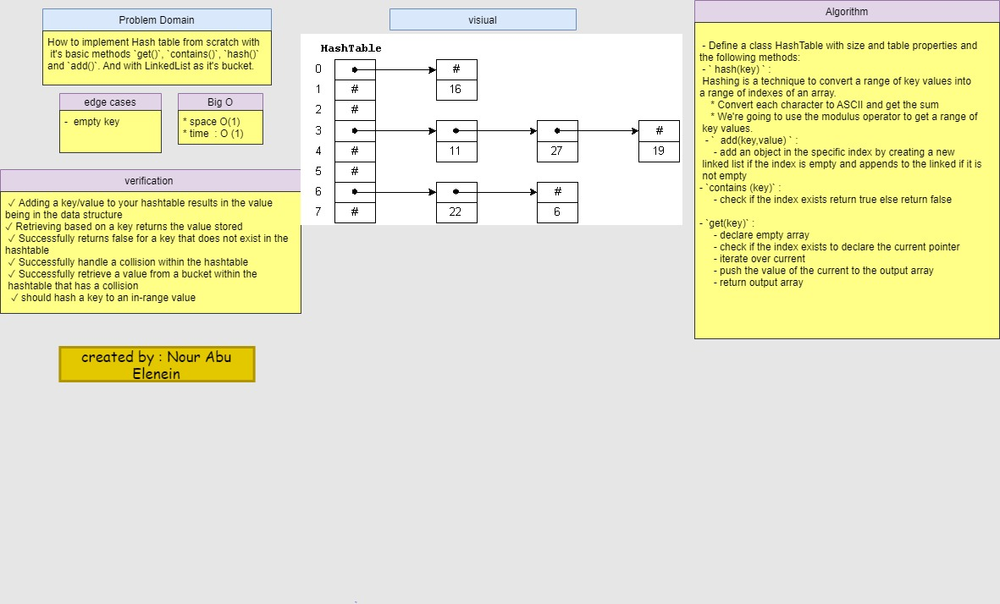

#  Hash Tables

 Hash Table is a data structure which stores data in an associative manner. In a hash table, data is stored in an array format, where each data value has its own unique index value. Access of data becomes very fast if we know the index of the desired data.

Thus, it becomes a data structure in which insertion and search operations are very fast irrespective of the size of the data. Hash Table uses an array as a storage medium and uses hash technique to generate an index where an element is to be inserted or is to be located from.

## Challenge

How to implement Hash table from scratch with it's basic methods `get()`, `contains()`, `hash()` and `add()`. And with LinkedList as it's bucket.

## Approach & Efficiency

 - Define a class HashTable with size and table properties and the following methods:

 - ` hash(key) ` :
 Hashing is a technique to convert a range of key values into a range of indexes of an array.
    * Convert each character to ASCII and get the sum
    * We're going to use the modulus operator to get a range of key values. 

  - `  add(key,value) ` :
     - add an object in the specific index by creating a new linked list if the index is empty and append to the linked if it is not empty

- `contains (key)` :
     - check if the index exists return true else return false      

- `get(key)` :
     - declare empty array
     - check if the index exists to declare the current pointer 
     - iterate over current 
     - push the value of the current to the output array
     - return output array 

- time O(1) in the best case and in the worst case O(n)
- space O(1)

## API

- `add:`
   - Arguments: key, value
   - Returns: nothing
   - This method should hash the key, and add the key and value   pair to the table, handling collisions as needed.

- ` get:` 
    - Arguments: key
    - Returns: Value associated with that key in the table
- `contains:` 
   - Arguments: key
   - Returns: Boolean, indicating if the key exists in the table already.
- ` hash:` 
   - Arguments: key
   - Returns: Index in the collection for that key

## solution 

