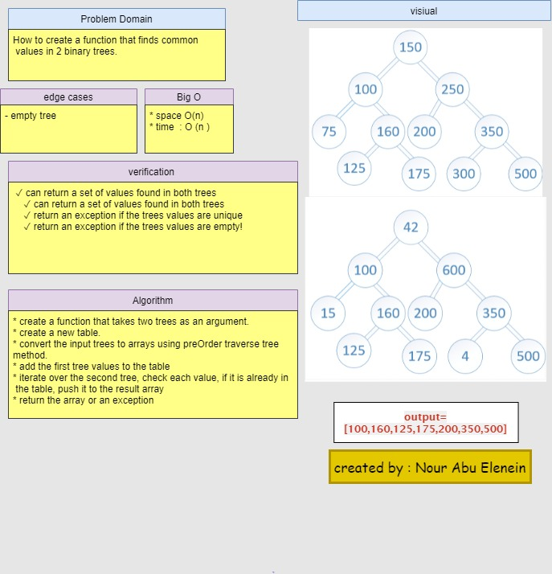

#  hashmap-tree-intersection

## Challenge

How to create a function that finds common values in 2 binary trees.

## Approach & Efficiency

* create a function that takes two trees as an argument.
* create a new table.
* convert the input trees to arrays using preOrder traverse tree method.
* add the first tree values to the table
* iterate over the second tree, check each value, if it is already in the table, push it to the result array
* return the array or an exception
 

- time O(n) 
- space O(n)

## API
Find all values found to be in 2 binary trees

Write a function called tree intersection
- Arguments: two binary trees
- Return: array

## solution 

