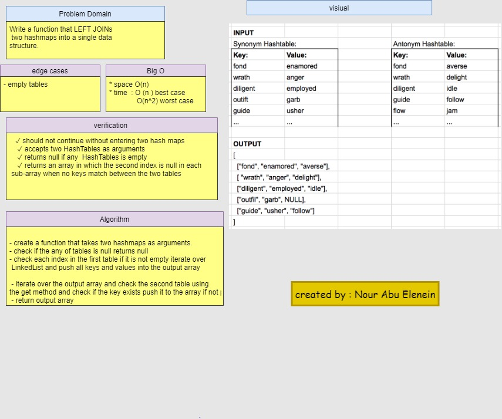

#  Left Joins function

## Challenge

Write a function that LEFT JOINs two hashmaps into a single data structure.

## Approach & Efficiency

- create a function that takes two hashmaps as arguments.
- check if the any of tables is null returns null
- check each index in the first table if it is not empty iterate over LinkedList and push all keys and values into the output array
 
 - iterate over the output array and check the second table using the get method and check if the key exists push it to the array if not push null
 - return output array 

* **complexity**
- time O(n)  best case, worst case O(n^2)
- space O(n)

## API

- Write a function that LEFT JOINs two hashmaps into a single data structure.

- Write a function called left join
Arguments: two hash maps
- The first parameter is a hashmap that has word strings as keys, and a synonym of the key as values.
- he second parameter is a hashmap that has word strings as keys, and antonyms of the key as values.
- Return: The returned data structure that holds the results is up to you. It doesn’t need to exactly match the output below, so long as it achieves the LEFT JOIN logic

## solution 

