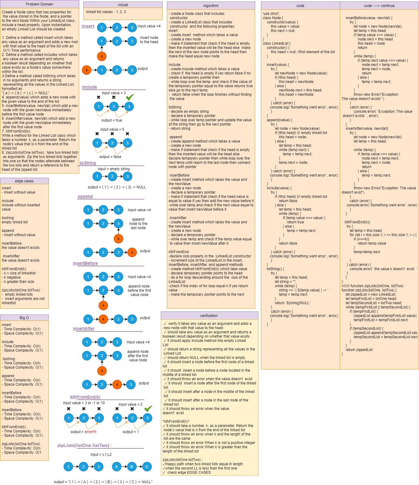

# Singly Linked Lists

Create a Node class that has properties for the value stored in the Node, and a pointer to the next Node.
Within your LinkedList class, include a head property. Upon instantiation, an empty Linked List should be created.

### Challenge

How To create singly linked list form scratch with different methods and test those methods. and to make semantic (custom) error.

### Approach & Efficiency

### **insert method**
- create insert  method which takes a value
- create a new node
- make if statement that check if the head is empty
then the inserted value will be the head else  make
the next of the new node points to the head then
make the head equal new node

**Big O**
- Time Complexity: O(n).
- Space Complexity: O(1).

--- 

### **include method:**
- create include method which is take a value
- check if  the head is empty if yes return false if no
create a temporary pointer then
- while loop over the temp  and check if the value of
the temporary pointer equal to the value return true 
else go to the next temp
-  return false when the loop finish without finding
 the value 

**Big O**
- Time Complexity: O(n).
- Space Complexity: O(1).

---

### **toString**
- declare an empty string
- declare a temporary pointer
- while loop over temp pointer and update the value 
of the string then go to the next pointer 
- return string

**Big O**
- Time Complexity: O(n).
- Space Complexity: O(1)..

---
### **append:**
- create append method which takes a value
- create a new node
- make if statement that check if the head is empty
then the inserted value will be the head else 
declare temporary pointer then while loop over the
next temp until reach to the last node then connect 
node with pointer

**Big O**
- Time Complexity: O(n).
- Space Complexity: O(1).

---

### **append:**
- create append method which takes a value
- create a new node
- make if statement that check if the head is empty
then the inserted value will be the head else 
declare temporary pointer then while loop over the
next temp until reach to the last node then connect 
node with pointer

**Big O**
- Time Complexity: O(n).
- Space Complexity: O(1).

### insertBefore:
- create insert method which takes the value and 
the newValue
- create a new node
- declare a temporary pointer
- make if statement that check if the head.value is
equal to value if yes then add the new value before it
-while over temp and check if the next value equal to 
value then insert newValue before it

**Big O**
- Time Complexity: O(n).
- Space Complexity: O(1).
---

### insertAfter:
- create insert method which takes the value and 
the newValue
- create a new node
- declare a temporary pointer
- while over temp and check if the temp.value equal
 to value then insert newValue after it

**Big O**

- Time Complexity: O(n).
- Space Complexity: O(1).

---

### zipLists:

* create function zipLists(listOne listTwo)  takes in two different LLs start with creating new LL.

* define the current value for both of the LLs provided as head

* start a while loop whenever the current of both LLs have a value, in the loop check if the current for each LL still has a value 
* if true insert the value to the new LL starting form first LL value to insert the head from the first LL
* update the current for each LL
 * if false exit the while loop and return the new LL.

**Big O**

- Time Complexity: O(n).
- Space Complexity: O(1).
---

## API
* **insert() :** allow you to insert new values at the end of the linked list. (return the whole class to allow chaining insertion)

* **include() :** To evaluate wither the linked list has a cretin value in it or not (returns a boolean).

* **toString() :** return a string of the linked list values in format of "{ a } -> { b } -> { c } -> NULL"

* **kthFromEnd(k):** a method for the Linked List class which takes a number, k, as a parameter. Return the node’s value that is k from the end of the linked list. 

* **append():** which adds a new node with the given value to the end of the list

* **insertBefore(value, newVal) :** which add a new node with the given newValue immediately before the first value node

* **insertAfter(value, newVal) :** which add a new node with the given newValue immediately after the first value node

* **zipLists(listOne listTwo) :** takes two linked lists as arguments. Zip the two linked lists together into one so that the nodes alternate between the two lists and return a reference to the head of the zipped list.

---

### Solution

### github workflow actions

[Go Here](https://github.com/engnour94/data-structures-and-algorithms/actions)

### 401 Challenges

[Go Here!](/javascript/Readme.md)

 

