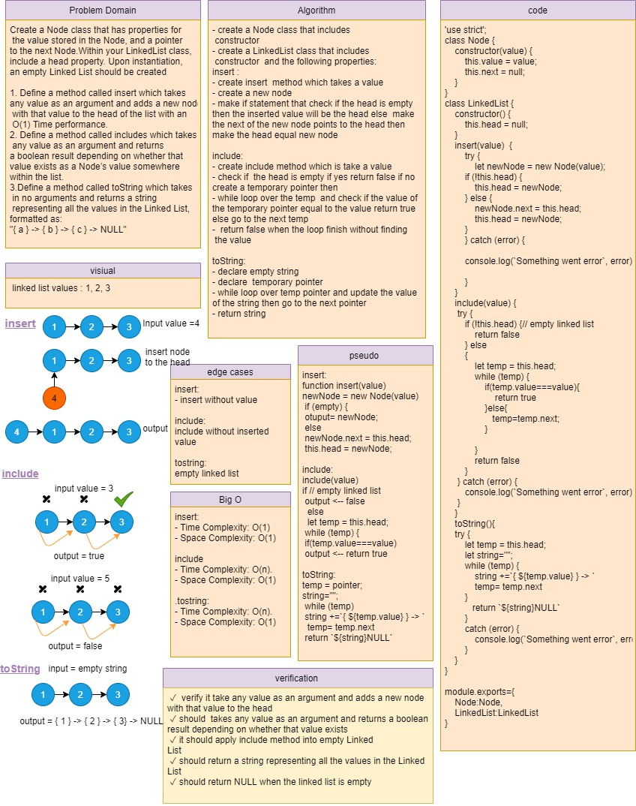
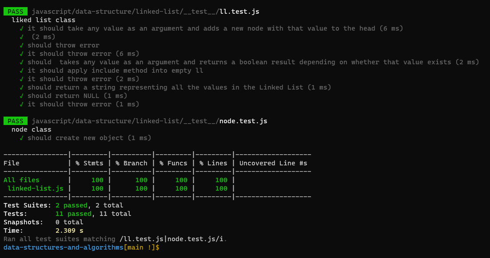

# Singly Linked Lists

Create a Node class that has properties for the value stored in the Node, and a pointer to the next Node.
Within your LinkedList class, include a head property. Upon instantiation, an empty Linked List should be created.

### Challenge

How To create singly linked list form scratch with different methods and test those methods. and to make semantic (custom) error.

### Approach & Efficiency

**insert method**
- create insert  method which takes a value
- create a new node
- make if statement that check if the head is empty
then the inserted value will be the head else  make
the next of the new node points to the head then
make the head equal new node

**Big O**
Time Complexity: O(1).
Space Complexity: O(1).

**include method:**
- create include method which is take a value
- check if  the head is empty if yes return false if no
create a temporary pointer then
- while loop over the temp  and check if the value of
the temporary pointer equal to the value return true 
else go to the next temp
-  return false when the loop finish without finding
 the value 

**Big O**
Time Complexity: O(n).
Space Complexity: O(1).
To string representation:

**toString**
- declare an empty string
- declare a temporary pointer
- while loop over temp pointer and update the value 
of the string then go to the next pointer 
- return string

**Big O**
Time Complexity: O(n).
Space Complexity: O(1).

## API
* insert() : allow you to insert new values at the end of the linked list. (return the whole class to allow chaining insertion)

* include() : To evaluate wither the linked list has a cretin value in it or not (returns a boolean).

* toString() : return a string of the linked list values in format of "{ a } -> { b } -> { c } -> NULL"
### Solution

## testing and verification

## 401 Challenges

[Go Here!](/javascript/data-structure/Readme.md)