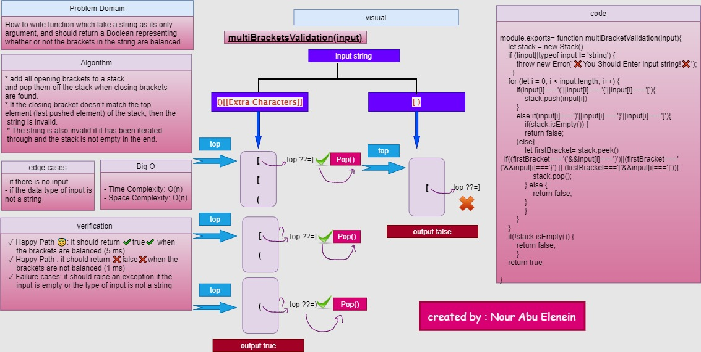

# Multi Bracket Validation

### Challenge

 How to write function which take a string as its only argument, and should return a boolean representing whether or not the brackets in the string are balanced. There are 3 types of brackets:
Round Brackets : ()
Square Brackets : []
Curly Brackets : {}

####  Approach & Efficiency

##### <----multiBracketValidation(input) --->
* The idea is to add all opening brackets to a stack and pop them off the stack when closing brackets are found.
* If the closing bracket doesn’t match the top element (last pushed 
 element) of the stack, then the string is invalid. 
 * The string is also invalid if it has been iterated through and the stack is not empty in the end.

**Big O**
- Time Complexity: O(n).
- Space Complexity: O(n).

---
### API
* **multiBracketValidation(input)** return true if the brackets are balanced and false if it is not
### Solution
[link](https://drive.google.com/file/d/1WJgdno9NBqlztJiFmuIWKBQL7gRehLjh/view?usp=sharing)

### github workflow actions

[Go Here](https://github.com/engnour94/data-structures-and-algorithms/actions)

### 401 Challenges

[Go Here!](/javascript/Readme.md)