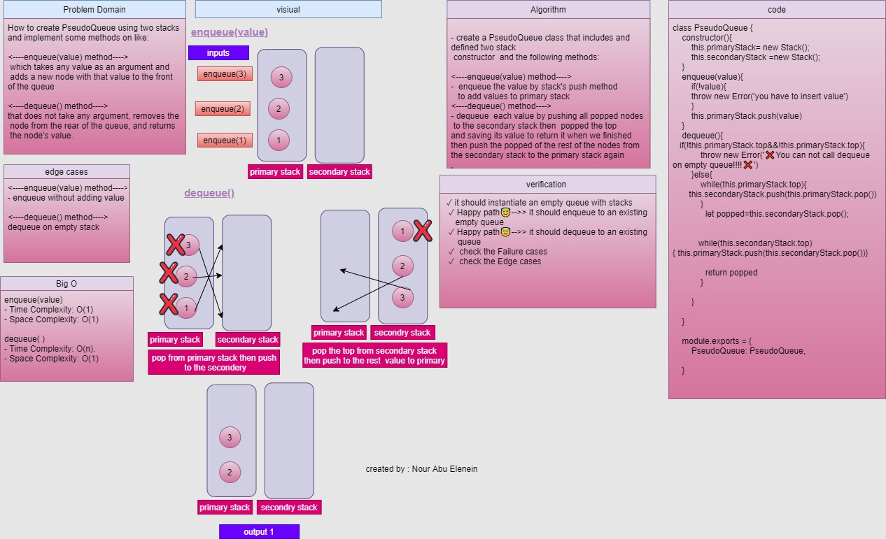

# Queue With Stacks
Create a `PseudoQueue` class using two `Stack` instances
### Challenge

   - The `PseudoQueue` should have `enqueue` and `dequeue` methods.
   - The two `Stack` instances can use `push` and `pop` methods.

####  Approach & Efficiency

##### <----enqueue(value) method---->
-  enqueue the value by stack's push method
   to add values to primary stack

**Big O**
- Time Complexity: O(1).
- Space Complexity: O(1).

--- 

### <----dequeue() method---->
- dequeue  each value by pushing all popped nodes
 to the secondary stack then  popped the top
and saving its value to return it when we finished
then push the popped of the rest of the nodes from
the secondary stack to the primary stack again

**Big O**
- Time Complexity: O(n).
- Space Complexity: O(1).
---
### API
The PseudoQueue class code contains two methods:

- `enqueue(value)` Adds a node to the queue.
- `dequeue()` Removes a node from the queue.
### Solution
[link](https://drive.google.com/file/d/1MerjmDwTducVuyd3XsuWqcNLj4ObU4TD/view?usp=sharing)

### github workflow actions

[Go Here](https://github.com/engnour94/data-structures-and-algorithms/actions)

### 401 Challenges

[Go Here!](/javascript/Readme.md)

 

