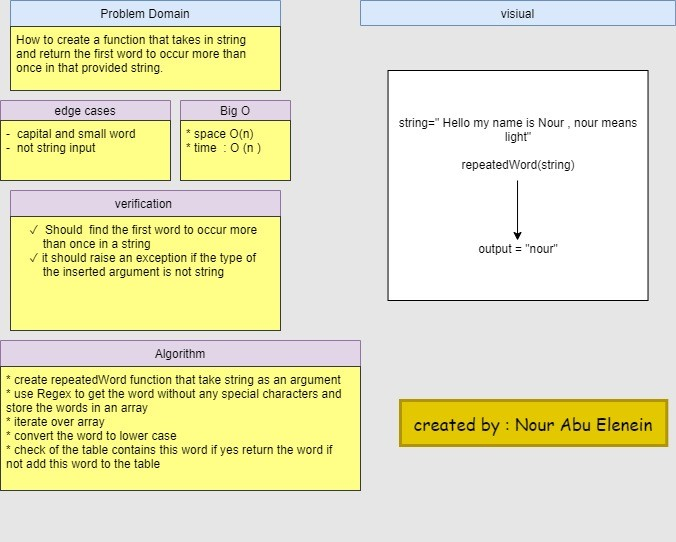

#  repeatedWord function

## Challenge

How to create a function that takes in string and return the first word to occur more than once in that provided string.

## Approach & Efficiency

* create repeatedWord function that take string as an argument 

* use Regex to get  the word without any special characters and store the words in an array

* iterate over array 
* convert the word to lower case 

* check of the table contains this word if yes return the word if not add this word to the table
 

- time O(n) 
- space O(n)

## API

Write a function called repeated word that finds the first word to occur more than once in a string

- Arguments: string
- Return: string

## solution 

