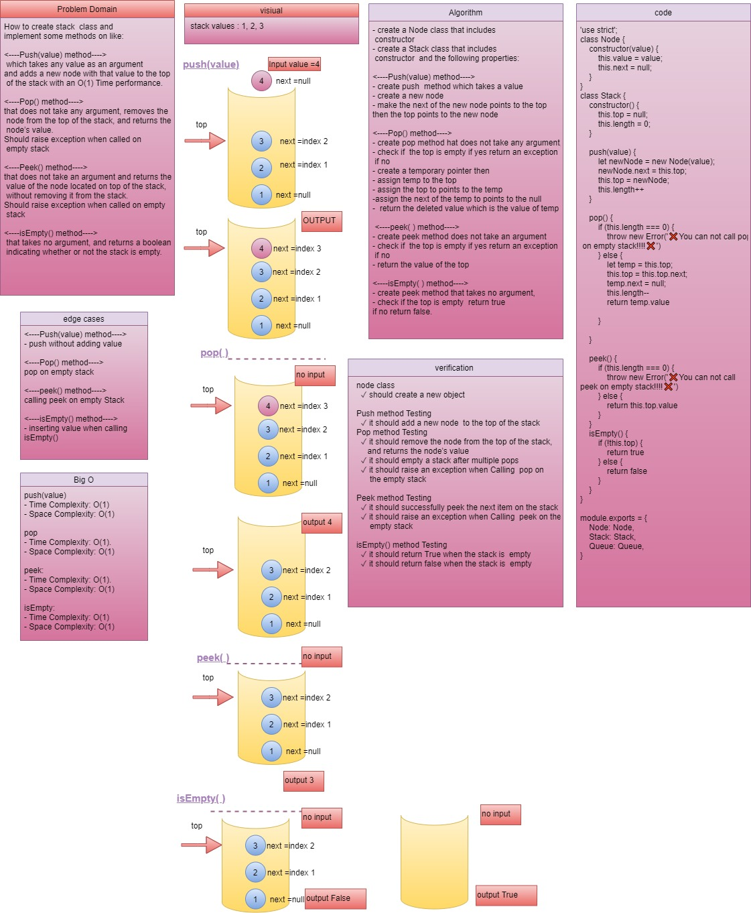
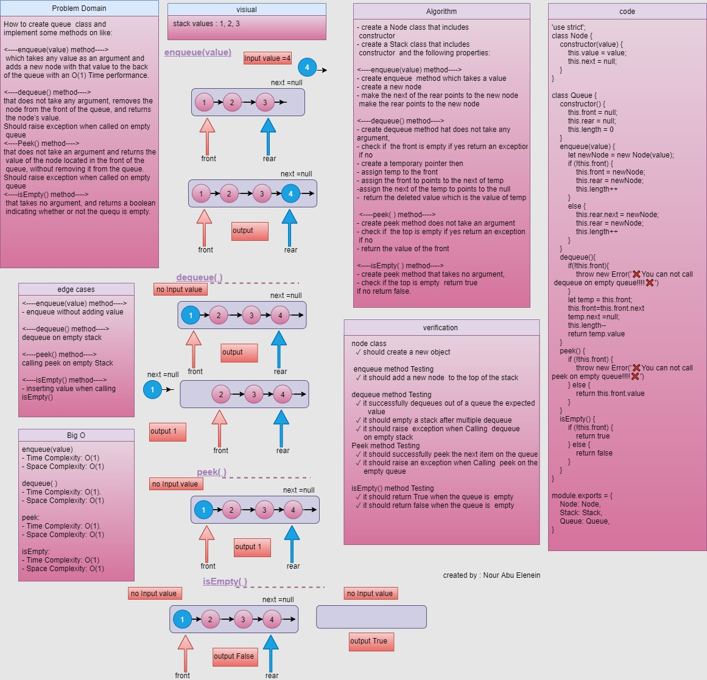

# Stack and Queue
Create and delete a Node class that has properties for the value stored in the Node, and a pointer to the next Node. Within the stack and queue classes
### Challenge

How To create Stack and Queue form scratch with different methods and test those methods. and to make semantic (custom) error.

### Stack data structure

####  Approach & Efficiency
##### <----push(value) method---->
- create push  method which takes a value
- create a new node
- make the next of the new node points to the top
then the top points to the new node

**Big O**
- Time Complexity: O(1).
- Space Complexity: O(1).

##### <----pop(value) method---->
- create pop method hat does not take any argument,
- check if  the top is empty if yes return an exception
 if no
- create a temporary pointer then
- assign temp to the top
- assign the top to points to the temp
-assign the next of the temp to points to the null
-  return the deleted value which is the value of temp

**Big O**
- Time Complexity: O(1).
- Space Complexity: O(1).

##### <----peek(value) method---->
- create peek method does not take an argument
- check if  the top is empty if yes return an exception
 if no
- return the value of the top

**Big O**
- Time Complexity: O(1).
- Space Complexity: O(1).

##### <----isEmpty(value) method---->
- create peek method that takes no argument,
- check if the top is empty  return true
if no return false.

**Big O**
- Time Complexity: O(1).
- Space Complexity: O(1).
---
## API

**<----push(value) method---->**
 which takes any value as an argument
and adds a new node with that value to the top
 of the stack with an O(1) Time performance.

**<----Pop() method---->**
that does not take any argument, removes the
 node from the top of the stack, and returns the
 node’s value.
Should raise exception when called on
 empty stack

**<----Peek() method---->**
that does not take an argument and returns the
 value of the node located on top of the stack,
 without removing it from the stack.
Should raise exception when called on empty
 stack

**<----isEmpty() method---->**
 that takes no argument, and returns a boolean
 indicating whether or not the stack is empty.

---
### Solution

---
### Queue data structure

####  Approach & Efficiency
##### <----enqueue(value) method---->
- create enqueue  method which takes a value
- create a new node
- make the next of the rear points to the new node
 - make the rear points to the new node

**Big O**
- Time Complexity: O(1).
- Space Complexity: O(1).

--- 

### <----dequeue() method---->
- create dequeue method hat does not take any
argument,
- check if  the front is empty if yes return an exception
 if no
- create a temporary pointer then
- assign temp to the front
- assign the front to points to the next of temp
-assign the next of the temp to points to the null
-  return the deleted value which is the value of temp 

**Big O**
- Time Complexity: O(n).
- Space Complexity: O(1).

---
##### <----peek(value) method---->
- create peek method does not take an argument
- check if  the top is empty if yes return an exception
 if no
- return the value of the top

**Big O**
- Time Complexity: O(1).
- Space Complexity: O(1).

##### <----isEmpty(value) method---->
- create peek method that takes no argument,
- check if the top is empty  return true
if no return false.

**Big O**
- Time Complexity: O(1).
- Space Complexity: O(1).
---

## API

**<----enqueue(value) method---->**
 which takes any value as an argument and
 adds a new node with that value to the back
of the queue with an O(1) Time performance.

**<----dequeue() method---->**
that does not take any argument, removes the
 node from the front of the queue, and returns
 the node’s value.
Should raise exception when called on empty
 queue

**<----Peek() method---->**
that does not take an argument and returns the
 value of the node located in the front of the
 queue, without removing it from the queue.
Should raise exception when called on empty
 queue

**<----isEmpty() method---->**
 that takes no argument, and returns a boolean
 indicating whether or not the stack is empty.

### Solution

### github workflow actions

[Go Here](https://github.com/engnour94/data-structures-and-algorithms/actions)

### 401 Challenges

[Go Here!](/javascript/Readme.md)

 

