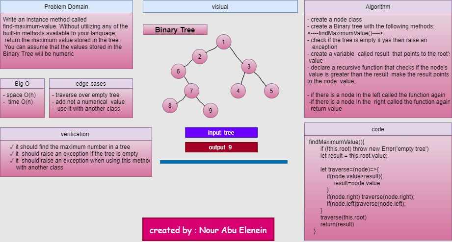
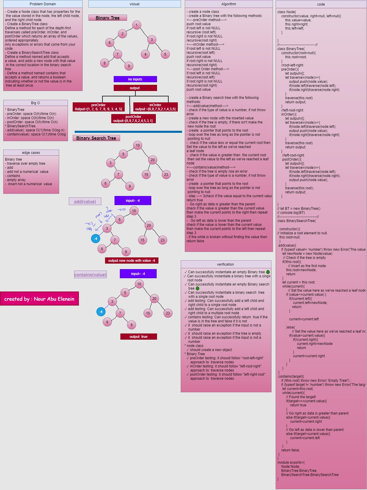

# Tree:
Trees are non-leaner data structure. and we want to implement the following :
- Binary Tree and Binary Search Tree 

### Challenge

- To make BinaryTree with 3 methods to traverse each nodes InOrder, PreOrder and PostOrder methods.
- To make BinarySearchTree with add() and contains() methods.
 
### Approach & Efficiency

#### BinaryTree
- preOrder: space O(h)/time O(n)
- inOrder: space O(h)/time O(n)
- postOrder: space O(h)/time O(n)

#### BinarySearchTree
- add(value): space O(1)/time O(log n)
- contain(value): space O(1)/time O(log n)
### <----findMaximumValue()---->
- create a node class
- create a Binary tree with the following methods:
<----findMaximumValue()---->
- check if the tree is empty if yes then raise an
   exception
- create a variable  called result  that points to the root's
 value 
- declare a recursive function that checks if the node's 
 value is greater than the result  make the result points
to the node  value;

- if there is a node In the left called the function again
 -if there is a node In the  right called the function again
- return value
### Big O
* space O(h)/time O(n)

--- 

---
### API

The BinaryTree contains the following methods:
1. **`preOrder()`** Returns an array with the tree values ordered root --> left --> right.
2. **`inOrder()`** Returns an array with the tree values ordered left ---> root > right.
3. **`postOrder()`** Returns an array with the tree values ordered root > left > right.
4. **`findMaximumValue()`** Returns the maximum value of a numeric tree.

The BinarySearchTree contains two methods:
1. **`add(value)`** Adds the input value in its place in the sorted tree.
2. **`contains(value)`** Search the tree and checks if the input value exists

### Solution

- code challenge 16

- code challenge 15
[Go here to more details !!!](https://drive.google.com/file/d/1IJD4NlWQ-1jAuP73tb7QKDsakSUslAQA/view?usp=sharing)

### github workflow actions

[Go Here!](https://github.com/engnour94/data-structures-and-algorithms/actions)

### 401 Challenges

[Go Here!](/javascript/Readme.md)

